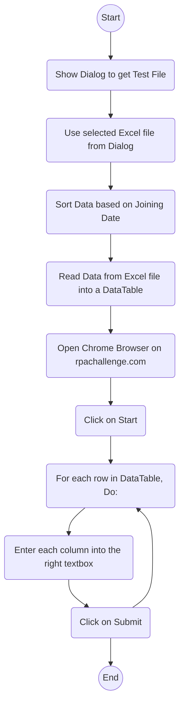

# RPA Challenge
Solution to [RPA Challenge](rpachallenge.com).

## Flowchart

The following flowchart shows the activites in the required sequence.

```mermaid
flowchart TD
  start((Start)) --> step1(Show Dialog to get Test File)
  step1(Show Dialog to get Test File) --> step3(Use selected Excel file from Dialog)
  step3(Use selected Excel file from Dialog) --> step4(Sort Data based on Joining Date)
  step4(Sort Data based on Joining Date) --> step5(Read Data from Excel file into a DataTable)
  step5(Read Data from Excel file into a DataTable) --> step6(Open Chrome Browser on rpachallenge.com)
  step6(Open Chrome Browser on rpachallenge.com) --> step7(Click on Start)
  step7(Click on Start) --> step8(For each row in DataTable, Do:)
  step8(For each row in DataTable, Do:) --> step9(Enter each column into the right textbox)
  step9(Enter each column into the right textbox) --> step10(Click on Submit)
  step10(Click on Submit) --> step8(For each row in DataTable, Do:)
  step10(Click on Submit) --> ending((End))
```
